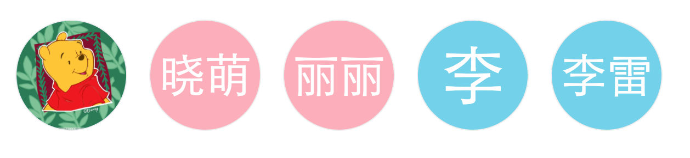

#Generated Avatar with jquery

*基于jquery的一个头像生成插件,自定义参数比较多,用于统一头像样式或者生成姓名文字头像*

__截图__

__调用方法__

入参 [object] 必填,即使不写参数,也要传入一个空对象

如：  
***
    $('#id').avatarIcon(params={});  
    或 
    var params={}; $('#id').avatarIcon(params);
    
    使用id选择器
    $('#id').avatarIcon(object);
    使用类选择器(数组)
    $('.class').avatarIcon(object);
***

__参数__
***
     var params = {
      name: string (可选参数，建议必填)             --- 姓名  字符串 如：张三， 不传则为 “未知” 
      url: string (可选参数，建议必填)              --- 头像url  字符串 如果有请传入，否则会多生成一个头像
      sub: int (可选参数)                          --- 截取长度，默认为一个字符，为2的时候，从后向前截取2个字符 如 sub==1的时候，张三，结果是张，sub==2的时候，结果是张三，三个字姓名，张宝贝，结果是宝贝。
      sex: string (可选参数，建议必填)              --- 性别  1个大写英文字母 M和F  默认 F
      width: string (可选参数)                     --- 头像宽度  标准css写法 如 100px,10em,  默认为100px
      height:string (可选参数)                     --- 头像高度  标准css写法 如 100px,10em,  默认为100px
      borderStyle: string (可选参数)               --- 边框风格  标准css写法 如solid,  默认为solid
      borderWidth: string (可选参数)               --- 边框宽度  标准css写法 如 1px,  默认为1px
      borderColor: string (可选参数)               --- 边框颜色  1个色值 如：'#bbb'，支持16进制，rgba，英文单词，默认#eee
      bgColor: array (可选参数)                    --- 背景颜色  2个色值 如：['#aaa','#bbb']，第一个是男，第二个是女，支持16进制，rgba，英文单词混合  默认['rgba(3, 143, 243, 0.6)', 'rgba(243, 3, 147, 0.6)']
      borderRadius: Boolean (可选参数)             --- 是否圆头像  true or false, 默认圆形头像
      lineHeight: string (可选参数)                --- 文字行高  标准css写法  如 100px   默认与头像高度一致
      textAlign: string (可选参数)                 --- 文字是否居中  标准css写法 ,如center. 默认center
      fontSize: string (可选参数)                  --- 文字大小  标准css写法 ,如12px. 默认 1个字 58px，2个字 42px
      color: string (可选参数)                     --- 文字颜色 1个色值 如：'#bbb'，支持16进制，rgba，英文单词，默认#fff* };
***

__注意__
* 1.请先引用jquery
* 2.如果在初始化入参没有传入参数,将会在selector里获取 data-name和data-sex
* 3.原来已经有头像的情况下，请将html格式写为  

      

        
      

      
将会在选择器下面的img标签自动找src的地址
* 4.以上注意事项请务必保留一个入参值 
* 5.同一个选择器请只调用一次

__示例代码__

      

          
      

          

          

          

      

__update__

*20170104*

1. 修复了多次以ID方式调用只生成第一个头像的问题,采用时间戳生成ID,最高支持9999个元素,自行可以更改

***
       var id = new Date().getTime().toString().slice(8); //修改slice的参数
***

####__最后__

* 练习小插件,高手勿喷,欢迎指点.
